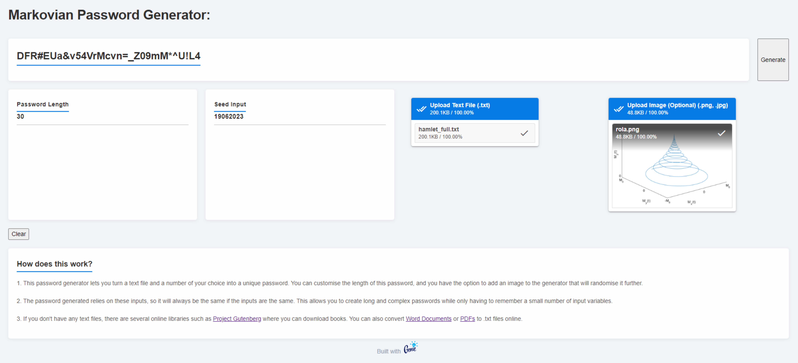

# Markovian-passwords
A genie framework Julia web app that creates unique, reproducible passwords using pseudo-random numbers and Markov chains. The application accepts two numerical inputs, a text file and an optional image which the code samples to create the passwords. 

